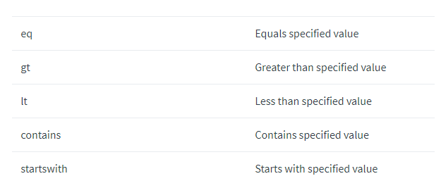

Get Started
===========

Cherwell Authentication:
------------------------

To start with Cherwell API , we must authenticate with User ID and Password along with API Key. After successful authentication it generates Bearer Access Token.
After that subsequent API calls we can use Access Token.

1. Get API Key generated by Cherwell Support team
2. Get User ID/Password set in the system with local account.
3. Get Base URL

*API EndPoint URL*: ``Base URL``/token

**In Python:**

.. code-block:: python

   import json,requests

   base_url = 'https://<Cherwell Domain>.cherwellondemand.com/CherwellAPI/'

   tokenuri = base_url + 'token'
   def getCherwellToken():
       data = {'grant_type' : 'password',
               'client_id' : '*API_KEY*',
               'username' : '*Username*',
               'password' : '*Password*'}
       session = requests.post(url=tokenuri, data=data)
       if session:
           token = json.loads(session.text)
       else:
           token = None
       return 'Bearer ' + token['access_token']

   access_token = getCherwellToken()

This *access_token* can be used with header for later API calls.

Business Object Name
--------------------

Every item in Cherwell has it's own internal ID. Before getting ID, need to understand what are the Business Object exists.

Below table display Sample Business Object Names

.. list-table:: Sample Business Object1
   :widths: 50 50
   :header-rows: 1

   * - Business Object Name
     - Business Object Description
   * - ChangeRequest
     - Change Request
   * - Incident
     - Incident
   * - KnowledgeArticle
     - Knowledge Article
   * - Problem
     - Problem

To get all types, endpoint URL: *GET /api/V1/getbusinessobjectsummaries/type/All*

e.g., **In Python**

.. code-block:: python

    base_url = 'https://<Cherwell Domain>.cherwellondemand.com/CherwellAPI/'
    headers = {
        'Content-Type': 'application/json',
        'Authorization': access_token
        }

    def getAllType():
        url = base_url + 'api/V1/getbusinessobjectsummaries/type/All'
        response = requests.get( url, headers=headers)
        bustype = response.json()
        return bustype

The *bustype* variable will have JSON formatted response as sample below

.. code-block:: json

    {
        "firstRecIdField": "fa03dxxxxxxxxxxxxxx5b2ef7e04",
        "groupSummaries": [],
        "recIdFields": "fa03d5xxxxxxxxxxxxxef7e04",
        "stateFieldId": "5eb3234xxxxxxxxxxxxxa437f18d",
        "states": "Pending,Closed,Reopened,New,In Progress,Resolved,Assigned",
        "busObId": "6dd53xxxxxxxxxxxxxf6434ae",
        "displayName": "Incident",
        "group": false,
        "lookup": false,
        "major": true,
        "name": "Incident",
        "supporting": false
    }
    {
      "firstRecIdField": "933c8f20xxxxxxxxxxxxxxxxcd5206d6d4d85d",
      "groupSummaries": [],
      "recIdFields": "933c8f205xxxxxxxxxxxd5206d6d4d85d",
      "stateFieldId": "",
      "states": "",
      "busObId": "933c8f2050xxxxxxxxxxxxxxxxx8bc1f50c3fcbcec5",
      "displayName": "Incident Category",
      "group": false,
      "lookup": true,
      "major": false,
      "name": "IncidentCategory",
      "supporting": false
   }
    

If you look at response above it has BusOBID and other information. But this endpoint provides all the data types which will very big JSON output. 
So we have another endpoint where we can get only particular item.   

 *Get  /api/V1/getbusinessobjectsummary/busobname/{busobname}*

 Let's say for type Incident below is the sample code in Python:

.. code-block:: python

    base_url = 'https://<Cherwell Domain>.cherwellondemand.com/CherwellAPI/'
    headers = {
        'Content-Type': 'application/json',
        'Authorization': access_token
        }

    def getBusOBID(busobname):
        url = base_url + 'api/V1/getbusinessobjectsummary/busobname/' + busobname
        response = requests.get( url, headers=headers)
        busobid = response.json()
        return busobid

    inc_busobid = getBusOBID('Incident')

*inc_busobid* contains JSON response as below:

.. code-block:: json

    {
        "firstRecIdField": "fa03d5xxxxxxxxxxxxxxxx885b2ef7e04",
        "groupSummaries": [],
        "recIdFields": "fa03d51xxxxxxxxxxxxx85b2ef7e04",
        "stateFieldId": "5eb323xxxxxxxxxxxxxxxxa437f18d",
        "states": "Pending,Closed,Reopened,New,In Progress,Resolved,Assigned",
        "busObId": "6dd53xxxxxxxxxxxxxxxxf6434ae",
        "displayName": "Incident",
        "group": false,
        "lookup": false,
        "major": true,
        "name": "Incident",
        "supporting": false
    }

If you observe, the information displays same as previous but here the response will only one block compare to previous one.

Retrieve Item Details
---------------------

Now let's try to get item details in particular category.  

API Endpoint: *GET api/V1/getbusinessobject/busobid/{busobid}/publicid/{publicid}*

.. code-block:: python

    def getPublicID(busobid, publicid):
        url = base_url + 'api/V1/getbusinessobject/busobid/' + busobid + '/publicid/' + publicid
        response = requests.get( url, headers=headers)
        bus_details = response.json()
        return bus_details

    inc_bus_details = getPublicID(inc_busobid[0]['busObId'], '1141351')

*inc_bus_details* will have Json output of all the data of the incident 1141351 as below.

.. code-block:: json

    {
    "busObId": "6dd536xxxxxxxxxxxxxxxxxxxxxf6434ae",
    "busObPublicId": "1141351",
    "busObRecId": "946707f531ad2866a104114b25be566cad0c7cb0f0",
    "fields": [
        {
            "dirty": false,
            "displayName": "RecID",
            "fieldId": "BO:6dd536xxxxxxxxxxxxxxxxxxxxxf6434ae,FI:fa03d5xxxxxxxxxxx85b2ef7e04",
            "html": null,
            "name": "RecID",
            "value": "946707f531ad2866a104114b25be566cad0c7cb0f0"
        },
        {
            "dirty": false,
            "displayName": "Incident ID",
            "fieldId": "BO:6dd536xxxxxxxxxxxxxxxxxxxxxf6434ae,FI:6ae282c55xxxxxxxxxxxxfc070c17fa3",
            "html": null,
            "name": "IncidentID",
            "value": "1141351"
        },
        {
            "dirty": false,
            "displayName": "Created Date Time",
            "fieldId": "BO:6dd536xxxxxxxxxxxxxxxxxxxxxf6434ae,FI:c1e86xxxxxxxxxxxxx5189e9b19",
            "html": null,
            "name": "CreatedDateTime",
            "value": "10/15/2020 10:44 AM"
        },
        {
            "dirty": false,
            "displayName": "Created During",
            "fieldId": "BO:6dd536xxxxxxxxxxxxxxxxxxxxxf6434ae,FI:93e1db9dxxxxxxxxxxxxxx916a5134d385",
            "html": null,
            "name": "CreatedDuring",
            "value": "8 to 5 Monday thru Friday"
        },
        {
            "dirty": false,
            "displayName": "Created By ID",
            "fieldId": "BO:6dd536xxxxxxxxxxxxxxxxxxxxxf6434ae,FI:7605xxxxxxxxxxxxxxxxx9280a9fdf9",
            "html": null,
            "name": "CreatedByID",
            "value": "94542337aaee3d8e485462471c9bf9b2f00776e276"
        },
        {
            "dirty": false,
            "displayName": "Status",
            "fieldId": "BO:6dd536xxxxxxxxxxxxxxxxxxxxxf6434ae,FI:5eb323xxxxxxxxxxxxxx9eda437f18d",
            "html": null,
            "name": "Status",
            "value": "In Progress"
        }
    

It provides more info. Each data in each block of *fields* list.

Search a Item
-------------

Now let's see how to  search a ticket based on Requester Name. But before searching ticket, must get Requester Name field ID from schema by providing Incident Business Object ID.

*API_ENDPOINT: GET /api/V1/getbusinessobjectschema/busobid/{busobid}* 

.. code-block:: python

   def getBusObSchema(busobid):
        url = base_url + 'api/V1/getbusinessobjectschema/busobid/' + busobid
        response = requests.get( url, headers=headers)
        schema = response.json()
        return schema

   inc_schema = getBusObSchema(inc_busobid[0]['busObId'])

Below is the response of it.

.. code-block:: json
   
   {
   "busObId": "6dd536xxxxxxxxxxxxxxxxxxxxxf6434ae",
   "fieldDefinitions": [
      {
         "autoFill": false,
         "calculated": false,
         "category": "System",
         "decimalDigits": 0,
         "description": "The unique identifier for the record",
         "details": "Category=System, Default: NewID()",
         "displayName": "RecID",
         "enabled": false,
         "fieldId": "BO:6dd536xxxxxxxxxxxxxxxxxxxxxf6434ae,FI:fa03d51b7xxxxxxxxxxxxx2ef7e04",
         "hasDate": false,
         "hasTime": false,
         "isFullTextSearchable": false,
         "maximumSize": "42",
         "name": "RecID",
         "readOnly": false,
         "required": false,
         "type": "Text",
         "typeLocalized": "Text",
         "validated": false,
         "wholeDigits": 0
      }
      {
         "autoFill": false,
         "calculated": false,
         "category": "",
         "decimalDigits": 0,
         "description": "The reference number for the Incident",
         "details": "Full-text, Default: conditional",
         "displayName": "Incident ID",
         "enabled": false,
         "fieldId": "BO:6dd536xxxxxxxxxxxxxxxxxxxxxf6434ae,FI:6ae28xxxxxxxxxxxxxxxxxxx070c17fa3",
         "hasDate": false,
         "hasTime": false,
         "isFullTextSearchable": true,
         "maximumSize": "20",
         "name": "IncidentID",
         "readOnly": false,
         "required": false,
         "type": "Text",
         "typeLocalized": "Text",
         "validated": false,
         "wholeDigits": 0
      }

If you notice above response, there is key, value pair of fieldID. You need to extract this ID for Requester Name.

.. code-block:: python
   
   for field in inc_schema['fieldDefinitions']:
        if field['name'] == 'CustomerDisplayName':
            cust_fieldid = field['fieldId']

   print(cust_fieldid)

Above code will print below response:

``BO:6dd53665c0c24cab86870a21cf6434ae,FI:93734aaff77b19d1fcfd1d4b4aba1b0af895f25788``

Now data filter has to be prepared to get the ticket details based on Requester Name.

.. code-block:: python

   data = {
            "busObId": inc_busobid[0]['busObId'],
            "pageNumber": 0,
            "pageSize": 1000,
            "includeAllFields": "true",
            "filters": [
                {
                    "fieldID": cust_fieldid,
                    "operator": "contains",
                    "value": "Pramod Manjunatha"
                }
                ]
            }

The API for Search is HTTP POST method. Hence this data block is necessary.

Below is the table provides information on Operator to be used. 

You can specify more than one filter. If you add multiple filters for the same field ID, the result is an OR operation between those filters. If the field IDs are different, the result is an AND operation between those filters.

*API Endpoint: POST /api/V1/getsearchresults*

.. code-block:: python

   def searchTickets(data):
        url = base_url + 'api/V1/getsearchresults'
        response = requests.post( url, headers=headers, data=data)
        result = response.json()
        return result

   search_result = searchTickets(json.dumps(data))

*search_result* contains the response of all the tickets raised by requester name

.. code-block:: json

   {
   "businessObjects": [
      {
         "busObId": "6dd536xxxxxxxxxxxxxxxxxxxxxf6434ae",
         "busObPublicId": "83709",
         "busObRecId": "9456dfcxxxxxxxxxxxxxxxxxxxxxxxxxxa7fe9088",
         "fields": [
            {
               "dirty": false,
               "displayName": "RecID",
               "fieldId": "BO:6dd536xxxxxxxxxxxxxxxxxxxxxf6434ae,FI:fa03d51xxxxxxxxxxxxxx2ef7e04",
               "html": null,
               "name": "RecID",
               "value": "9456dfcbf0xxxxxxxxxxxxxxx1f6a7fe9088"
            }
            {
               "dirty": false,
               "displayName": "Incident ID",
               "fieldId": "BO:6dd536xxxxxxxxxxxxxxxxxxxxxf6434ae,FI:6ae282c55xxxxxxxxxxxxxxxx70c17fa3",
               "html": null,
               "name": "IncidentID",
               "value": "83709"
            }
            {
               "dirty": false,
               "displayName": "Created Date Time",
               "fieldId": "BO:6dd536xxxxxxxxxxxxxxxxxxxxxf6434ae,FI:c1e86f3xxxxxxxxx5189e9b19",
               "html": null,
               "name": "CreatedDateTime",
               "value": "12/6/2019 4:05:12 PM"
            }

In the above response, *businessObjects* contains all the tickets raised by the requester. This is how we can search an item. This can be used for any Business Object like, Knowledge Article, Change Request, Problem ticket etc...

Create Items
------------

Now let's see how we can create an incident using Cherwell API.

Before you start to create incident, you need to gather few informations.

